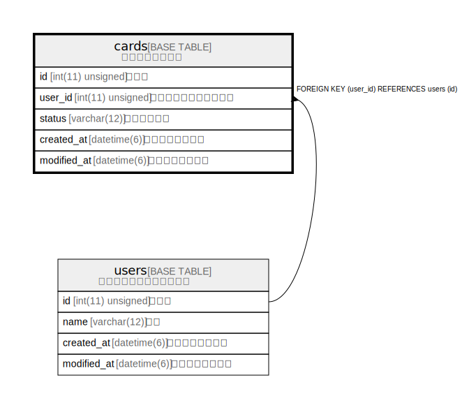

# cards

## Description

デモ用のサンプル

<details>
<summary><strong>Table Definition</strong></summary>

```sql
CREATE TABLE `cards` (
  `id` int(11) unsigned NOT NULL AUTO_INCREMENT COMMENT '識別子',
  `user_id` int(11) unsigned NOT NULL COMMENT 'カードユーザーの識別子',
  `status` varchar(12) DEFAULT NULL COMMENT 'カードの状態',
  `created_at` datetime(6) NOT NULL COMMENT 'レコード作成日時',
  `modified_at` datetime(6) NOT NULL COMMENT 'レコード修正日時',
  PRIMARY KEY (`id`),
  KEY `fk_user_id` (`user_id`),
  CONSTRAINT `fk_user_id` FOREIGN KEY (`user_id`) REFERENCES `users` (`id`)
) ENGINE=InnoDB DEFAULT CHARSET=utf8 COMMENT='デモ用のサンプル'
```

</details>

## Columns

| Name | Type | Default | Nullable | Extra Definition | Children | Parents | Comment |
| ---- | ---- | ------- | -------- | --------------- | -------- | ------- | ------- |
| id | int(11) unsigned |  | false | auto_increment |  |  | 識別子 |
| user_id | int(11) unsigned |  | false |  |  | [users](users.md) | カードユーザーの識別子 |
| status | varchar(12) |  | true |  |  |  | カードの状態 |
| created_at | datetime(6) |  | false |  |  |  | レコード作成日時 |
| modified_at | datetime(6) |  | false |  |  |  | レコード修正日時 |

## Constraints

| Name | Type | Definition |
| ---- | ---- | ---------- |
| fk_user_id | FOREIGN KEY | FOREIGN KEY (user_id) REFERENCES users (id) |
| PRIMARY | PRIMARY KEY | PRIMARY KEY (id) |

## Indexes

| Name | Definition |
| ---- | ---------- |
| fk_user_id | KEY fk_user_id (user_id) USING BTREE |
| PRIMARY | PRIMARY KEY (id) USING BTREE |

## Relations



---

> Generated by [tbls](https://github.com/k1LoW/tbls)
